# Assembly Instructions 🛠️

## Required parts
Refer to the [BOM](BOM.md)

## Step 1: Printing

### General print parameters
(These were the settings i used you can adjust to your needs)

* Layer height: 0.2mm
* Infill: 15% Grid
* Nozzle size: 0.4mm
* Material: Petg

### Printing instructions
Everything in the STLs folder needs to be printed (except the lettering which is optional), special instructions are:

### Flanges
Both flanges should be printed with this orientation mating surface facing up, no supports, brim required.

### Main structure parts front/back
Should be printed flat side facing down. Front part will require supports where the emblem is, back part will require support where the cable inlet is located, brim is recommended for both parts to prevent warping.

### Top cover
Should be printed as such arrow looking up. No supports, brim required.

### C-Clamp
Printed on its back, no support or brim required.

### Bell mouth intake
Printed as such the curved inlet part facing the bed definitely needs support, no brim required.

## Step 2: Assembly
***DISCLAIMER:*** This part of the guide will include fucking with ***high voltage*** AC electricity you can actually ***die*** if not careful, if you do then don't blame me. Proceed with ***caution***.

1) Start by fastening the flanges to their respective main structure parts using four m3x5mm screws for each, They will fasten directly into the flange plastic with no hex nuts.

2) Insert the fan inside the circular hole in the main structure back part, making sure to fish the fan cables into the cable hole as you do.

3) Insert four m3 hex nuts in the interlocking notches on back part.

4) Merge the front and back parts carefully and fasten four m3x10mm screws in places shown.

5) Fasten two m3x25mm screws with two hex nuts as shown.
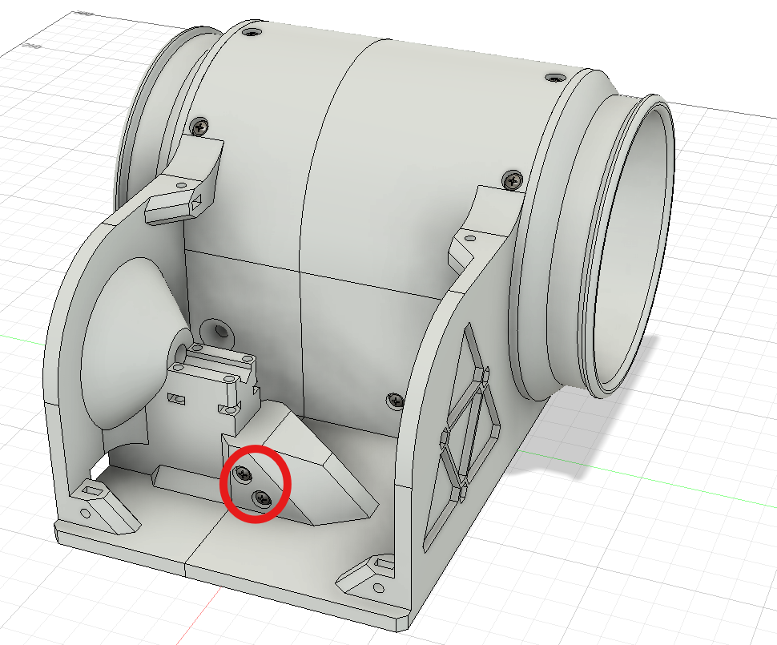
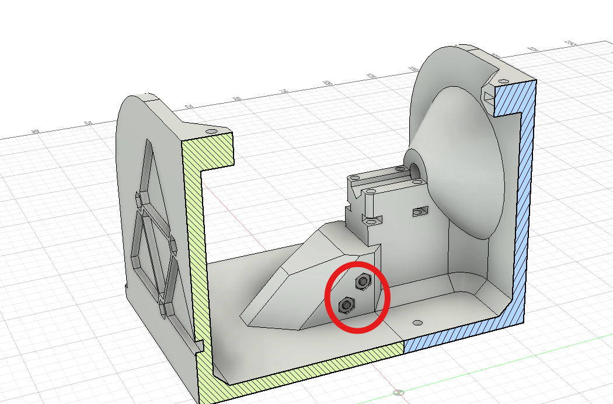

6) Insert the ac cable into the cable hole fasten it with the c-clamp using four m3x20mm screws and four hex nuts as shown. No need to overtighten the c-clamp tighten until you get good compression and give it a firm pull to see if its secure, do not tighten all the way.
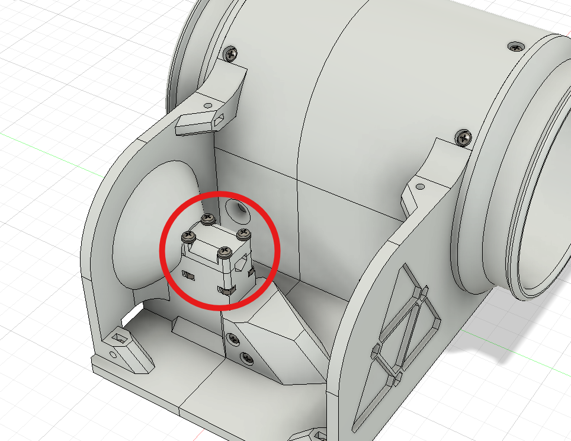

7) Take your on/off switch solder two 15cm length copper wires to the spade terminals, and insert it into its place (make sure to heatshrink the solder joints).
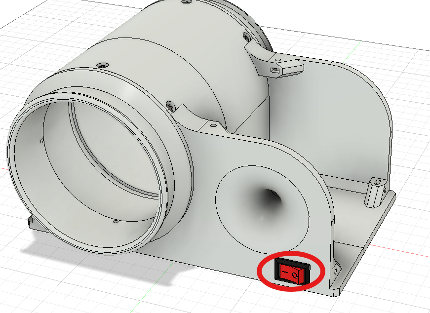

8) Insert your neon bulb in its place on the top cover glue it in place using super glue or hot glue (solder extension wires to the bulbs leads if theyre not long enough to connect to the screw terminal)
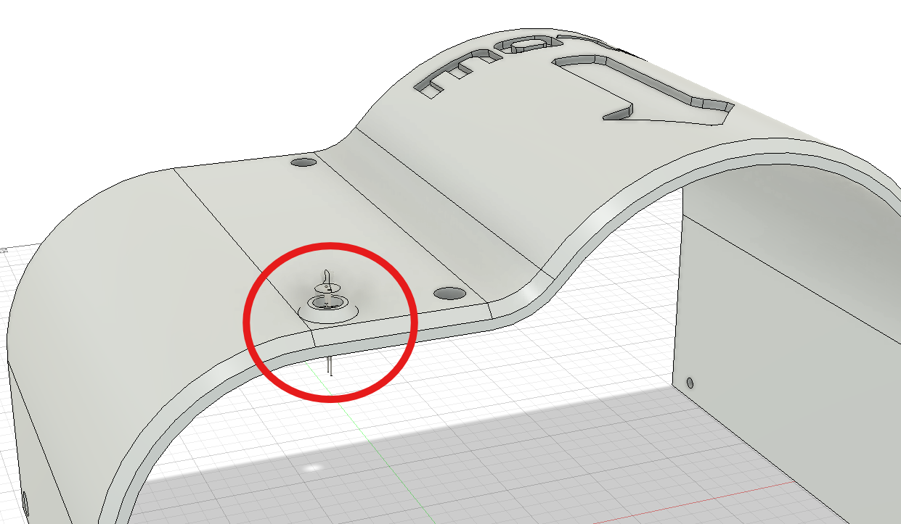

9) Do the cabling according to this schematic.
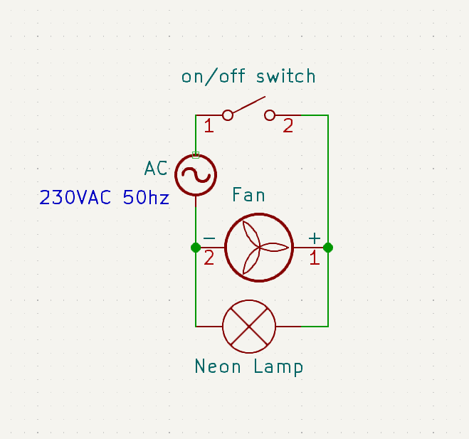

How to do it is up to you but i did it as such, live ac wire interrupted by the switch connected together with a wago connector and the output of the switch is connected to one side of the screw terminal, neutral ac wire is directly connected to the other side of the screw terminal. Also the neon bulb is wired in parallel into the screw terminal block in the exact places where the ac cables were inserted. Then on the opposite side of the terminal block the fan wires are connected also in parallel to the circuit, the terminal block is screwed down with a m3x10mm screw plus a hex nut and thats it. Irl photos for reference.
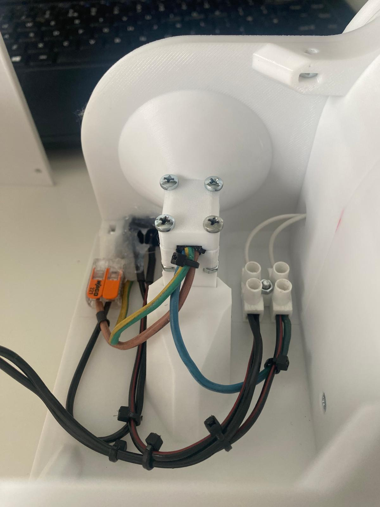
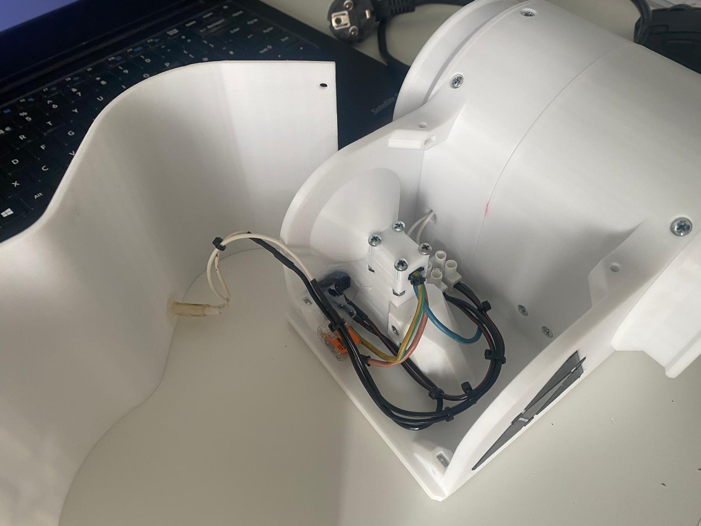
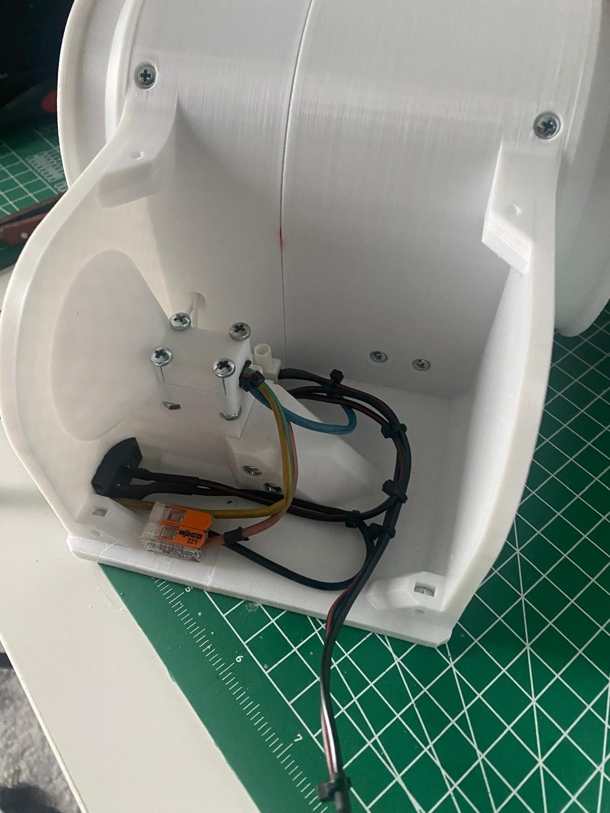
Additionally i glued the wago down with a drop of hot glue, tidied everything up with zipties and tucked the ground wire to the side with hotglue since we don't need it and i dont want it wiggling around in there.

10) Insert six hex nuts in total as shown.
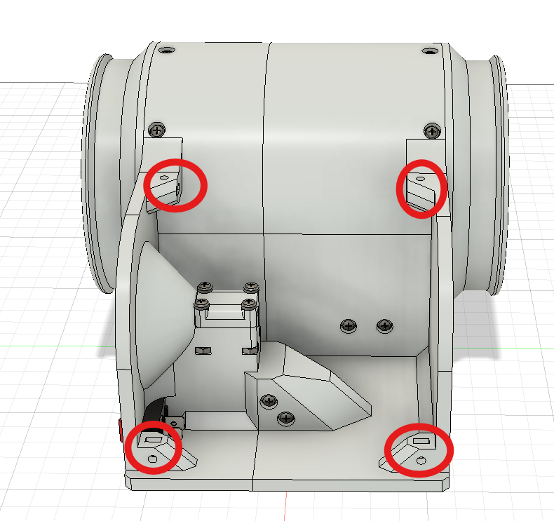
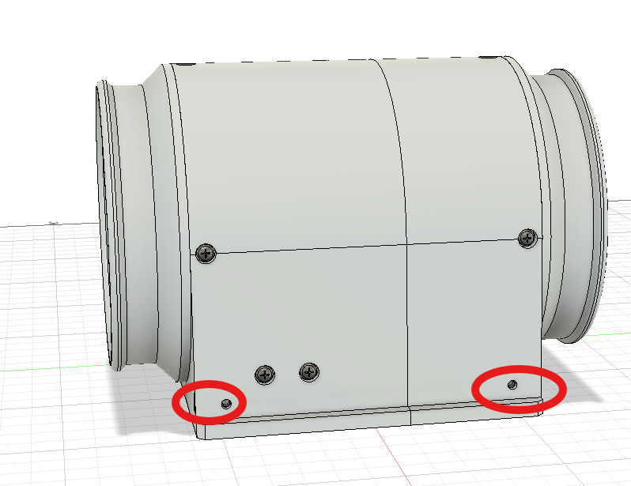

11) Screw down the top cover using six m3x10mm screws.
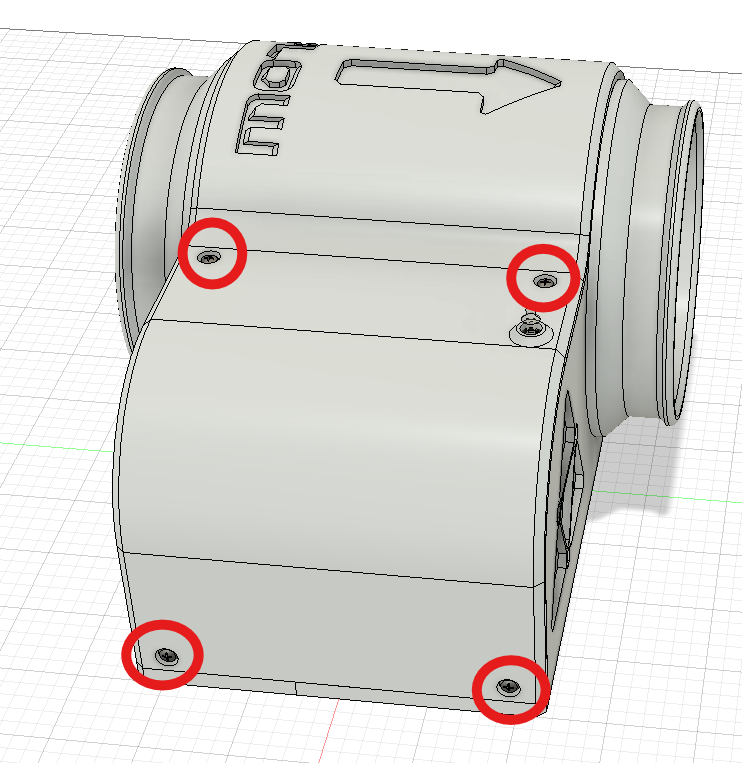
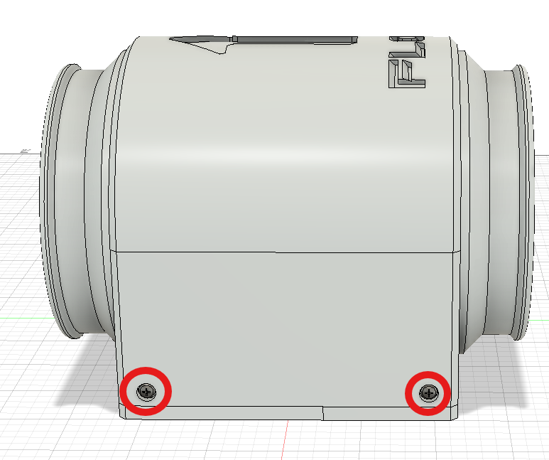

## Done ✅
That is it from the assembly. Additionally you can print the lettering and glue them in place but otherwise you should have a functional fume extractor, connect it together with the intake using hvac hosing and test it.