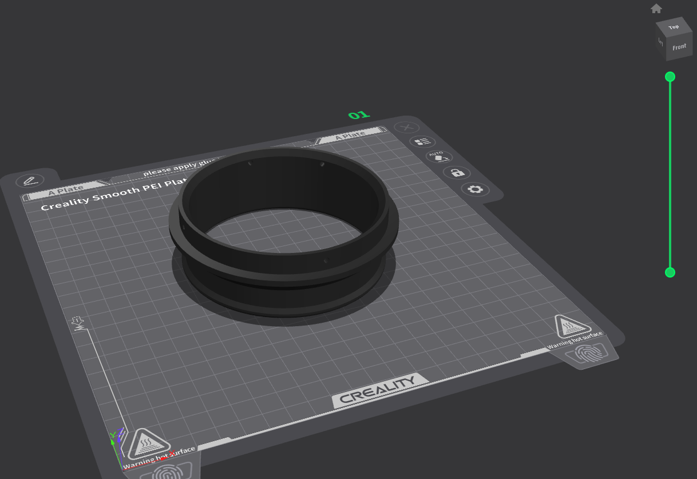
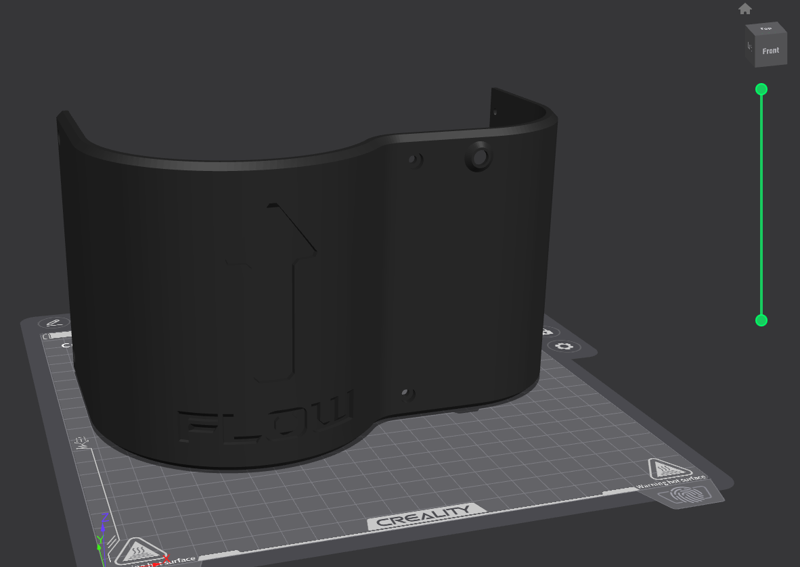
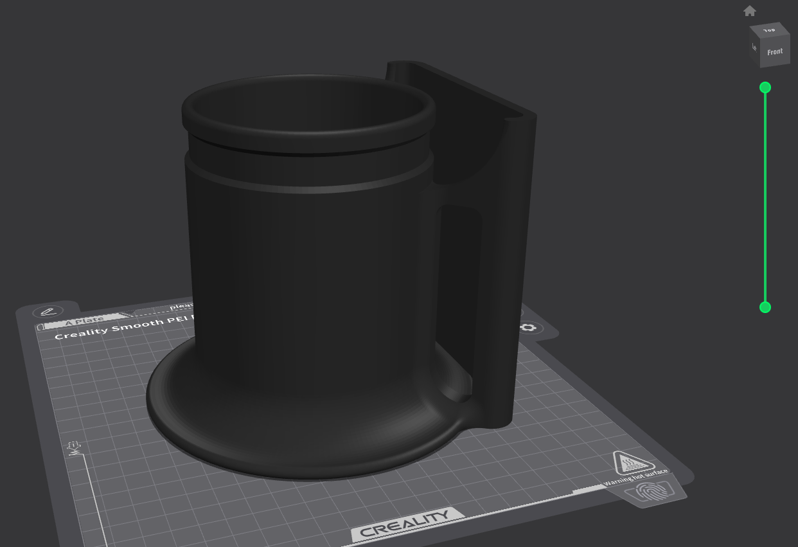
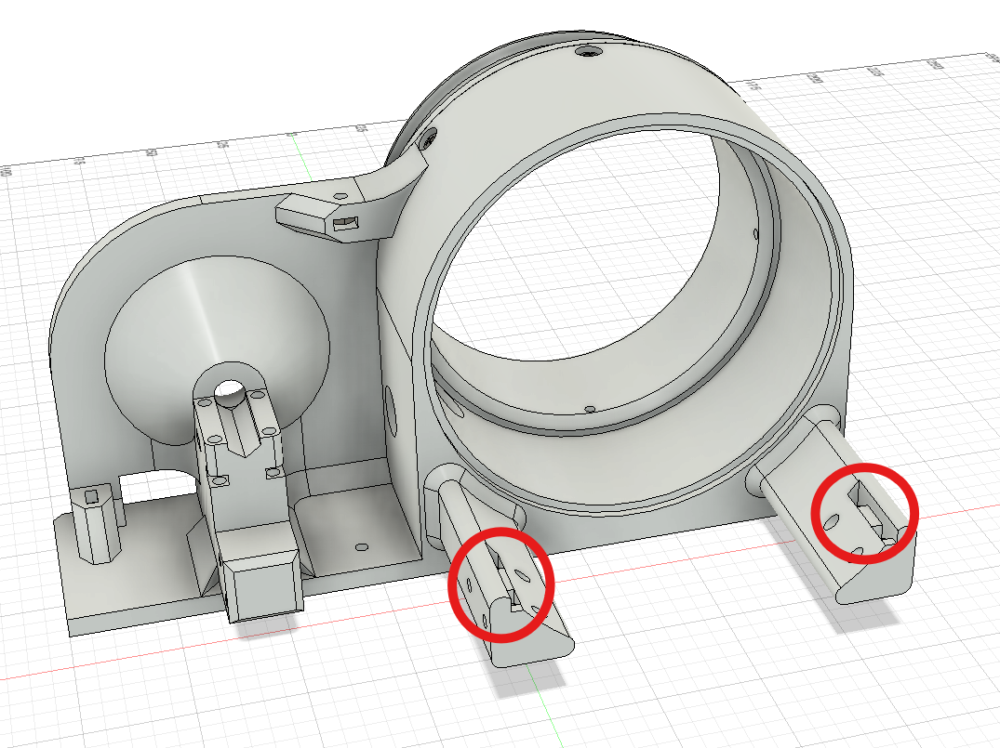
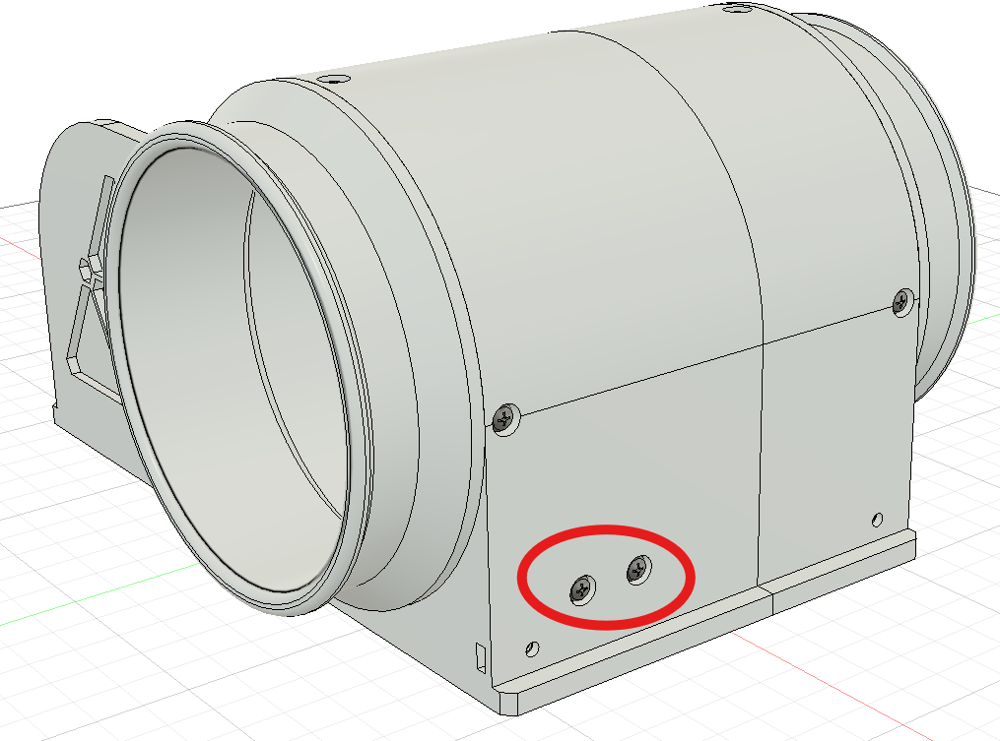
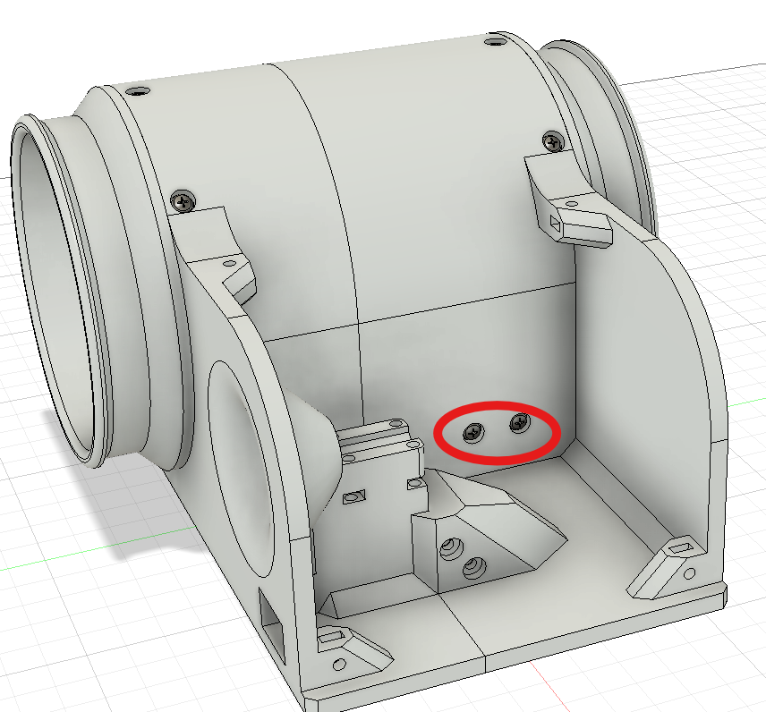

# Assembly Instructions 🛠️

## Required parts
Refer to the [BOM](BOM.md)

## Step 1: Printing

### General print parameters
(These were the settings i used you can adjust to your needs)

* Layer height: 0.2mm
* Infill: 15% Grid
* Nozzle size: 0.4mm
* Material: Petg

### Printing instructions
Everything in the STLs folder needs to be printed (except the lettering which is optional), special instructions are:

### Flanges
Both flanges should be printed with this orientation mating surface facing up, no supports, brim required.

### Main structure parts front/back
Should be printed flat side facing down. Front part will require supports where the emblem is, back part will require support where the cable inlet is located, brim is recommended for both parts to prevent warping.

### Top cover
Should be printed as such arrow looking up. No supports, brim required.

### C-Clamp
Printed on its back, no support or brim required.

### Bell mouth intake
Printed as such the curved inlet part facing the bed definitely needs support, no brim required.

## Step 2: Assembly
***DISCLAIMER:*** This part of the guide will include fucking with ***high voltage*** AC electricity you can actually ***die*** if not careful, if you do then don't blame me. Proceed with ***caution***.

1) Start by fastening the flanges to their respective main structure parts using five m3x5mm screws for each, They will fasten directly into the flange plastic with no hex nuts.

2) Insert the fan inside the circular hole in the main structure back part, making sure to fish the fan cables into the cable hole as you do.

3) Insert four m3 hex nuts in the interlocking notches on back part.

4) Merge the front and back parts carefully and fasten four m3x10mm screws in places shown.

5) 