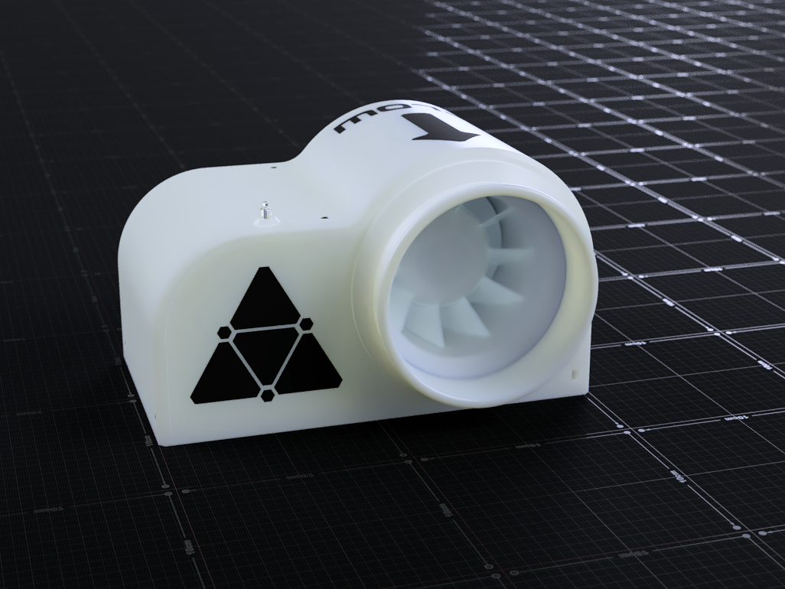

# Fume-ExtractorV1

This project wasn't originally meant to be shared and was more so something I built with parts I had on hand. This is why it includes weird parts like a neon bulb or a non standard inline fan, but I figured I might as well share it if anyone for some reason happened to have these parts on hand and wanted to build it, or to at least draw some inspiration for their own projects. It is a fume extractor for soldering consisting of one inline fan module with a 100mm radial fan and a bellmouth intake.

[Assembly Guide](AssemblyInsructions.md)

